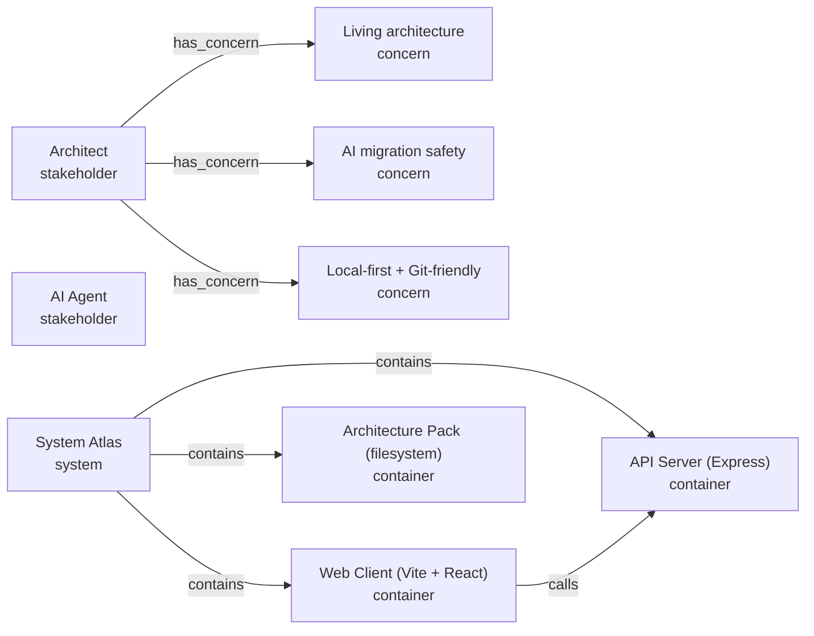

# System Atlas — Architecture

> Generated from the System Atlas pack by `generateArchitectureDoc`. Treat the typed atlas graph as the source of truth — change the authored concept files under `architecture/` (or the project's `scripts/build-*-atlas.ts` regenerator) and re-export instead of editing this file by hand.

Local-first architecture workbench. This pack is the dogfooded model of System Atlas itself.

## System Context

### System Atlas

**Criticality:** high · **Owner:** architecture · **Status:** active

- Edit, validate, and export a typed architecture graph
- Generate Mermaid, Markdown, context packs, and migration briefs for AI agents

## Stakeholders & Concerns

### Stakeholders

- **Architect** — _Software architect / project owner_ — cares about Living architecture, AI migration safety, Local-first + Git-friendly
- **AI Agent** — _Claude Code, Codex, or comparable coding agent_

### Concerns

- **Living architecture** (Operability, priority Critical) — The diagrams must not drift from the code _(addressed by: Workspace is runtime state, not env-locked, The architecture graph is the product core, Views own their layouts)_
- **AI migration safety** (Reliability, priority Critical) — AI must not silently weaken invariants when implementing a proposal _(addressed by: Observed evidence is separate from intended design, Proposals are first-class)_
- **Local-first + Git-friendly** (Operability, priority High) — Architecture state must live in repo files reviewable in Git _(addressed by: Repo files beat an app database for v1)_

## System Diagram

## Services & Containers

| Name | Type | Criticality | Ports | Depends on | Responsibilities | Key files |
| --- | --- | --- | --- | --- | --- | --- |
| Web Client (Vite + React) | Container | high | 5173 | API Server (Express) | React Flow canvas for each architecture view; Trigger Scan/Validate/Export/Brief via the API | \`src/\`, \`index.html\`, \`vite.config.ts\` |
| API Server (Express) | Container | high | 5174 | Architecture Pack (filesystem) | Serve /api endpoints; Read and write the architecture/ pack on disk; Run the workspace scanner | \`server/index.ts\` |
| Architecture Pack (filesystem) | Container | critical | — | — | Hold the authored architecture state and all derived artifacts; Round-trip cleanly between UI and disk | \`architecture/\` |

## APIs & Contracts

- **REST API (/api)** (Api Contract) — auth: None (local-only) · GET /api/project, /api/templates, /api/code-intelligence, /api/pack-health, /api/project/revision; POST /api/draft/validate, /api/export, /api/scan, /api/context-pack, /api/proposal, /api/migration-brief

## Frontend Pages

- **Workbench (/)** — route `/` — Single-page React app that owns the entire workbench: canvas, inspector, inventory, preview panel

## Data Stores

| Store | Type | Owner | Retention | Consistency |
| --- | --- | --- | --- | --- |
| Evidence files | Datastore | atlas-files | Until next Scan rewrites it | Overwritten as a unit on Export |
| Workspace registry (per-machine) | Datastore | workspaces module | Indefinite per-user | Atomic writes via temp+rename |

## Deployment & Configuration

### Environment Variables

| Variable | Scope | Sensitive | Required | Default |
| --- | --- | --- | --- | --- |
| SYSTEM_ATLAS_API_PORT | server (Express) + vite proxy | no | no | 5174 |
| SYSTEM_ATLAS_WEB_PORT | vite | no | no | 5173 |
| SYSTEM_ATLAS_WORKSPACE | server (Express) | no | no | process.cwd() |

## Technology Stack

| Technology | Category | Version | Rationale |
| --- | --- | --- | --- |
| React 19 | Frontend framework | ^19.0.0 | Mature ecosystem, React Flow integration, useState/useMemo are enough for this app's state shape |
| Vite 6 | Build tool | ^6.0.6 | Fast HMR, simple config, first-class React plugin |
| @xyflow/react | Library | ^12.8.5 | Production-grade graph editor; pan/zoom/select/edge-routing handled out of the box |
| Express 5 | Backend framework | ^5.1.0 | Smallest dependency that gives JSON routes; the API has 11 endpoints with no auth/middleware needs |
| TypeScript strict mode | Language | ^5.7.2 | Discriminated unions for NODE_TYPES/EDGE_TYPES/VIEW_IDS make the typed graph self-validating |

> This captures the load-bearing technology choices. The complete, version-pinned dependency set lives in the project's package manifests (for example `package.json`, `pyproject.toml`, or `Cargo.toml`).

## Key Decisions

| Decision | Status | Rationale |
| --- | --- | --- |
| The architecture graph is the product core | Accepted | All derived artifacts (Mermaid, MD, briefs) come from the typed graph, not free-text |
| Repo files beat an app database for v1 | Accepted | Architecture state is exported into architecture/ for Git review |
| Observed evidence is separate from intended design | Accepted | Scanner output never silently rewrites the authored atlas |
| Proposals are first-class | Accepted | Migration briefs are generated from before/after snapshots, not loose prompts |
| Views own their layouts | Accepted | Each view stores its own positions instead of using a single global node position |
| Workspace is runtime state, not env-locked | Accepted | Earlier design read SYSTEM_ATLAS_WORKSPACE once at server boot. That forced a restart to switch projects. The runtime registry pattern matches what tools like Postman / TablePlus do — launch once, work on any project. |

## Risks & Known Issues

| Risk | Likelihood | Impact | Mitigation |
| --- | --- | --- | --- |
| Client bundle creeping past 500 KB Vite warns; mermaid and React Flow are the heavy ones | Observed | Slower first-load, no functional break | Lazy-load mermaid; consider manualChunks |
| src/lib/atlas.ts past 2000 lines Single file owns validation, layout, generation, diff, import — sustainable for now but watch for further growth | Observed | Cognitive load on changes | Split along natural seams when next major feature lands |
| Default API port 5174 collides with a-private-project Without a startup check the API is silently shadowed by whatever already owns the port | Observed | All /api calls 404 against the wrong service | Startup port-conflict check; configurable port via env |

## Security & Threats

- **Mermaid CSS/HTML injection (CVEs)** — mermaid 11.0–11.14 has open advisories around classDefs / config sanitisation · mitigation: npm audit fix to the next patched line; render only architect-authored input

## Quality Scenarios

- **Pack round-trip fidelity** — Export → reload → semantic equality of nodes, edges, flows, views, proposals must hold · measured by: Validation passes, semanticDiff returns empty after roundtrip

## Flows

### Greenfield design → AI implementation

**Criticality:** high

Architect models the intended system, creates a proposal between architecture versions, then hands an AI agent a migration brief.

Steps:

1. Start from blank or generic starter atlas
2. Add systems, containers, components, datastores, contracts, risks, decisions _(atlas-core (pure domain))_
3. Create a proposal capturing the next architecture change _(Proposals are first-class)_
4. Generate migration brief via /api/migration-brief _(REST API (/api))_
5. AI agent implements the diff and updates architecture files together _(AI Agent)_
6. Architect reviews, validates, resolves conflicts

Failure modes:

- AI silently weakens an invariant
- Proposal acceptance checks are too vague to verify

Acceptance checks:

- Validation passes after import
- All flows still have linked tests

### Brownfield import → first atlas

**Criticality:** high

Scan an existing repository, promote useful discovered facts into authored nodes, then commit the architecture pack.

Steps:

1. Point System Atlas at the consumer project (SYSTEM_ATLAS_WORKSPACE) _(API Server (Express))_
2. Click Scan → /api/scan indexes structure, files, classes, routes, schemas _(atlas-files (I/O + scanner))_
3. Review Import Review and promote relevant evidence into authored nodes _(Import Review)_
4. Manually model datastores, contracts, flows, risks, decisions _(Inspector)_
5. Export the pack so the AI agent reads it on the next session _(atlas-files (I/O + scanner))_

Failure modes:

- Scanner mis-classifies a file and adds noise to the atlas
- Architect over-promotes inferred facts without confirming them

Acceptance checks:

- Inferred nodes carry confidence: inferred until reviewed
- Pack Health reports healthy after Export

### UI edit → autosync export

**Criticality:** high

Edits in the canvas debounce-export the pack and update Pack Health.

Steps:

1. Architect edits a node in the Inspector _(Inspector)_
2. App debounces, calls /api/export with the current baseRevision _(REST API (/api))_
3. exportAtlas writes the changed concept files and regenerates derived files _(atlas-files (I/O + scanner))_
4. Pack Health turns healthy; status footer shows synced timestamp

Failure modes:

- External edit happens between debounce and Export → 409 conflict
- Disk write fails mid-export and pack becomes misaligned

Acceptance checks:

- 409 surfaces to the user as 'External changes — reload or force'
- Pack Health flags misalignment within one revision check

### Add a project → switch workspace

**Criticality:** high

A single workbench instance manages many projects. Adding a workspace registers it and makes it current; switching reloads the pack without restart.

Steps:

1. User pastes an absolute project path into the picker (or onboarding card) _(Workspace Picker + Onboarding)_
2. Client POSTs /api/workspaces { path, name? } _(REST API (/api))_
3. workspaces module validates path, dedupes by canonical form, persists atomically _(workspaces registry)_
4. Server marks the new workspace current; next /api/project resolves against it
5. Client re-fetches project + health and renders the new pack

Failure modes:

- Bad path → 400 path_not_found
- Concurrent writes from two server instances would race the JSON file (single-user assumption holds)

Acceptance checks:

- After switch, Pack Health and inventory reflect the new project within one render
- Registry survives server restart

### External edit reconciliation

**Criticality:** high

When architecture files change on disk while the UI has unsaved edits, prompt the architect to reload or force-export.

Steps:

1. API polls architectureRevision() _(atlas-files (I/O + scanner))_
2. Web detects the on-disk revision diverged from the loaded one
3. User picks Reload (discard UI edits) or Export with force=true

Failure modes:

- User force-exports and loses upstream edits

Acceptance checks:

- Force path requires explicit confirmation

---

_Generated by System Atlas. See `architecture/generated/overview.md` for a compact summary, `architecture/generated/atlas.json` for the full typed graph, and `architecture/generated/diagrams/` for per-view Mermaid sources._